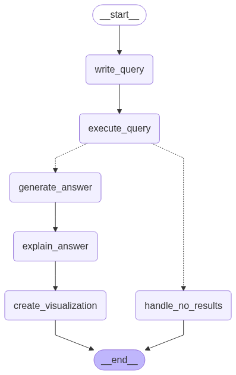

# chat-your-data

Chat with your SQL database and make complex queries with natural language using LLMs


The system enables users to interact with databases using natural language. It understands questions, generates queries, interprets results, and creates meaningful visualizations.

## Tech Stack and Architecture

It was built with: **LangChain** & **LangGraph** (LLM interaction and workflow), **Chainlit** (frontend), **BigQuery** (database) and **Google Gemini**.

The code is orchestrated between LLM functions and the Chainlit frontend following this architecture:

```
├── src/
│   ├── app.py              # Chainlit entry point
│   ├── workflow.py         # Core AI workflow functions
│   ├── orchestrator.py     # Workflow orchestration (chainlit <-> workflow) logic
│   ├── database.py         # BigQuery connection interface
│   └── system_prompts.py   # System prompt used to generate answers
├── public/                 # Static assets and UI resources
├── tests/                  # Unit tests
└── requirements.txt        # Dependencies
```

## Workflow



The system follows a simple 5-step workflow:

1. **Query Generation**: Converts natural language to SQL
2. **Query Execution**: Runs SQL on the BigQuery database  
3. **Answer Generation**: Interprets results in natural language
4. **Query Explanation**: Explains the SQL logic and approach
5. **Visualization**: Creates relevant Matplotlib visualizations

## Running

### Prerequisites
- Python 3.10+
- GCP account
- BigQuery dataset with the credit risk table uploaded
- Google AI API key

### Configuration

There are required environment variables. You must change the .env and have the database set up on BigQuery:

```bash
GOOGLE_API_KEY=your_gemini_api_key
GCP_KEY_PATH=./gcpkey.json
DATABASE_NAME=creditRisk
```

### Installation

1. **Clone repository**
   ```bash
   git clone https://github.com/fabiopapais/chat-your-data.git
   cd chat-your-data
   ```

2. **Install dependencies**
   
   (a virtual environment is recommended)
   ```bash
   pip install -r requirements.txt
   ```

3. **Configure environment**
   ```bash
   cp .env.example .env
   # Edit .env with your values
   ```

4. **Add GCP credentials**

   Place your service account key in the root directory (`gcpkey.json`).

5. **Run application**
   ```bash
   chainlit run src/app.py
   ```

### Running Tests

There is a simple test file for the main workflow pipeline:

```bash
python test_workflow.py
```

## Highlights

- **Scalability** - SQL-based queries and multi-table support for complex datasets
- **Zero Trust for LLMs** - The system is designed with a zero trust principle, ensuring read-only queries and output sanitization (by default)
- **Context Management** - Automatically handles large datasets and queries results without token overflow
- **Automated Visualizations** - Generates meaningful charts when sufficient data is available
- **Handles no result queries** - Manages cases where queries return no results and prevents errors
- **Standard Workflow** - Follows similar approaches to other validated text-to-SQL systems (https://arxiv.org/pdf/2410.01066, https://arxiv.org/abs/2406.08426, etc)

## Challenges and future work

- Question pre-analysis to prevent prompt injection and out of context queries
- RAG integration for more complex queries
- Automatic Schema description
- Improve workflow with retries and better error handling
    
    This was attempted but could be better with an agentic approach (agent having access to tools, contrary to current static workflow)